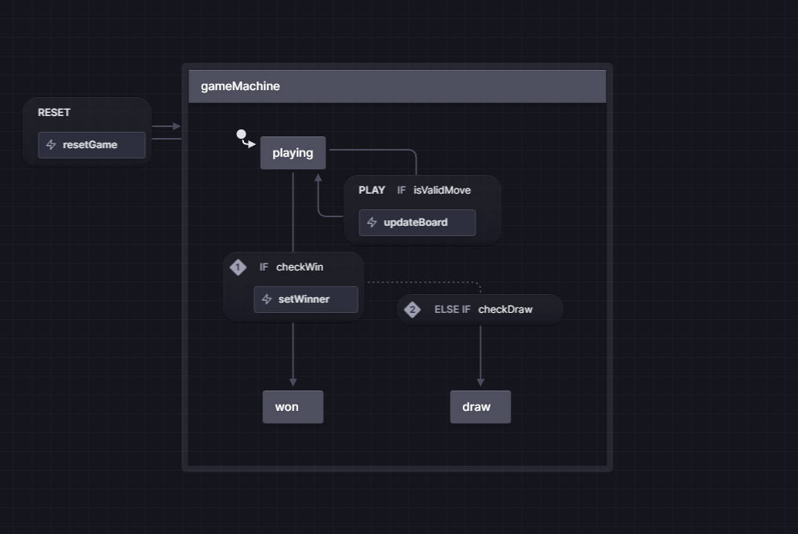

## Description

This state machine represents a game where players take turns making moves. The game starts in the "playing" state. While in this state, the machine checks if a player has won or if the game is a draw after each move. If a player wins, the machine transitions to the "won" state and sets the winner. If the game is a draw, it transitions to the "draw" state. Players can continue making moves as long as the moves are valid. There is also an option to reset the game by sending a "RESET" event. This will bring the game back to its initial state. Overall, this state machine manages the flow of a game, checks for win or draw conditions, and allows for resetting the game.

## Technical

In the state machine we have available states, events, actions and guards.

States:

- `PLAYING`
- `WON`
- `DRAW`

Events:

- `PLAY`
- `RESET`

Actions:

- `updateBoard`
- `resetGame`
- `setWinner`

Guards:

- `checkWin`
- `checkDraw`
- `isValidMove`

## Schema

